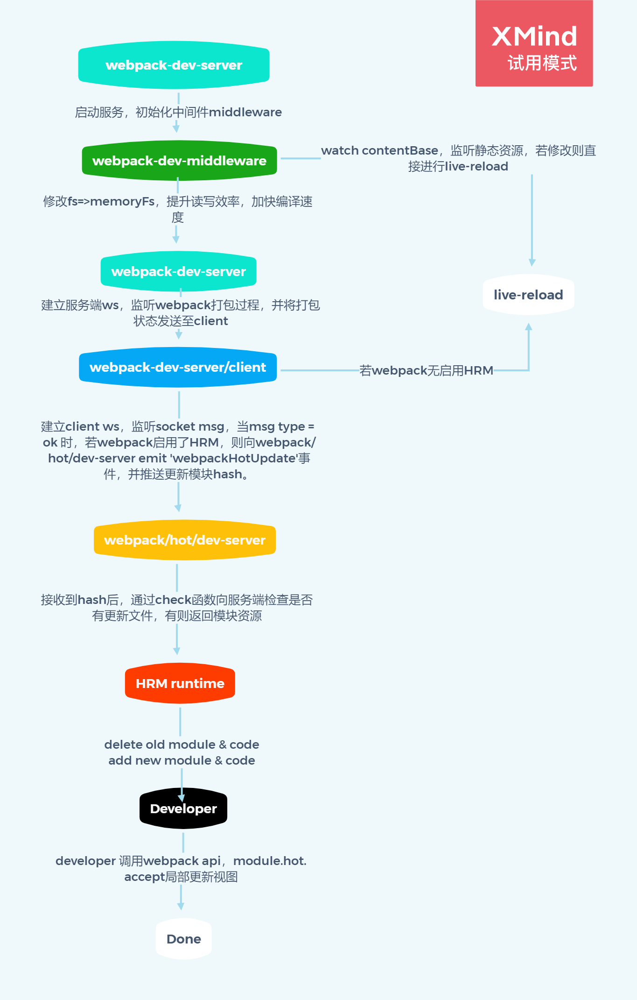

# Webpack HMR 原理浅析

## hot module replacement

>模块热替换(HMR - hot module replacement)功能会在应用程序运行过程中，替换、添加或删除 模块，而无需重新加载整个页面。主要是通过以下几种方式，来显著加快开发速度：
保留在完全重新加载页面期间丢失的应用程序状态。
只更新变更内容，以节省宝贵的开发时间。
在源代码中 CSS/JS 产生修改时，会立刻在浏览器中进行更新，这几乎相当于在浏览器 devtools 直接更改样式

## webpack4.x 配置

在webpack.config.js中添加devServer配置

### 默认使用live-reload
```js
// webpack.config.js

const path = require('path')
module.exports = {
	entry: './index.js',
	output: {
		filename: 'bundle.js',
		path: path.join(__dirname, '/')
	},
}
```
```js
// package.json

{
  // ...
  "scripts": {
+    "start": "webpack-dev-server"
  },
  // ...
}
```

### 启用HRM

设置devServer.hot = true即可启用HRM
```js{10-12}
// webpack.config.js

const path = require('path')
module.exports = {
	entry: './index.js',
	output: {
		filename: 'bundle.js',
		path: path.join(__dirname, '/')
	},
+	devServer: {
+		hot: true,
+	}
}
```

### 使用watchContentBase时，只触发live-reload
```js{12}
// webpack.config.js

const path = require('path')
module.exports = {
	entry: './index.js',
	output: {
		filename: 'bundle.js',
		path: path.join(__dirname, '/')
	},
	devServer: {
		hot: true,
+		watchContentBase: true,
	}
}
```

## HRM简易流程图



## HRM流程源码浅析

### 1.启动服务

在webpack-dev-server中启动服务并初始化webpack-dev-middleware，webpack-dev-middlewar调用webpack api对文件系统进行监听，并且修改文件系统对象，将文件的读写转移至内存中，大大提高了编译的效率，所以我们在启动本地服务时不会出现打包好的dist文件夹，但仍然可以访问编译完成的资源。

```js
// webpack-dev-server/bin/webpack-dev-server.js line 105 启动服务
  try {
    server = new Server(compiler, options, log);
    serverData.server = server;
  }

// webpack-dev-server/lib/Server.js line 209 初始化middleware中间件
  setupDevMiddleware() {
    // middleware for serving webpack bundle
    this.middleware = webpackDevMiddleware(
      this.compiler,
      Object.assign({}, this.options, { logLevel: this.log.options.level })
    );
  }

// webpack-dev-middleware/index.js line 39 middleware中间件调用webpack的api对文件系统进行watch
  // start watching
  if (!options.lazy) {
    context.watching = compiler.watch(options.watchOptions, (err) => {
      if (err) {
        context.log.error(err.stack || err);
        if (err.details) {
          context.log.error(err.details);
        }
      }
    });
  }

  
// webpack-dev-middleware/lib/fs.js line 114 middleware中间件修改文件系统对象
  if (isConfiguredFs) {
    // ...
  } else if (isMemoryFs) {
    fileSystem = compiler.outputFileSystem;
  } else {
    fileSystem = new MemoryFileSystem();

    // eslint-disable-next-line no-param-reassign
    compiler.outputFileSystem = fileSystem;
  }
```

### 2.建立ws长链接，同步编译状态

在webpack-dev-server中使用sockjs创建websocket链接，并且监听webpack打包的各个状态发送至client端。

```js{24-29}
// webpack-dev-server/lib/Server.js line 696 创建socket
  createSocketServer() {
    const SocketServerImplementation = this.socketServerImplementation;
    this.socketServer = new SocketServerImplementation(this);

    this.socketServer.onConnection((connection, headers) => {

      // ...
      this.sockets.push(connection);
      // ...
    }
  }

// webpack-dev-server/lib/Server.js line 171 注册webpack hook
  setupHooks() {
    // Listening for events
    const invalidPlugin = () => {
      this.sockWrite(this.sockets, 'invalid');
    };

    const addHooks = (compiler) => {
      const { compile, invalid, done } = compiler.hooks;

      compile.tap('webpack-dev-server', invalidPlugin);
      invalid.tap('webpack-dev-server', invalidPlugin);
      done.tap('webpack-dev-server', (stats) => {
        this._sendStats(this.sockets, this.getStats(stats));
        this._stats = stats;
      });
    };

    if (this.compiler.compilers) {
      this.compiler.compilers.forEach(addHooks);
    } else {
      addHooks(this.compiler);
    }
  }

  
// webpack-dev-server/lib/Server.js line 968 发送编译状态
  // send stats to a socket or multiple sockets
  _sendStats(sockets, stats, force) {
    const shouldEmit =
      !force &&
      stats &&
      (!stats.errors || stats.errors.length === 0) &&
      stats.assets &&
      stats.assets.every((asset) => !asset.emitted);

    if (shouldEmit) {
      return this.sockWrite(sockets, 'still-ok');
    }

    this.sockWrite(sockets, 'hash', stats.hash);

    if (stats.errors.length > 0) {
      this.sockWrite(sockets, 'errors', stats.errors);
    } else if (stats.warnings.length > 0) {
      this.sockWrite(sockets, 'warnings', stats.warnings);
    } else {
      this.sockWrite(sockets, 'ok');
    }
  }

```

client建立socket msg监听，当获取到type为ok的消息时，触发reloadApp函数，首先将 hash 值暂存到 currentHash 变量，当接收到 ok 消息后，对 App 进行 reload。如果配置了模块热更新，就调用 webpack/hot/emitter 将最新 hash 值发送给 webpack，然后将控制权交给 webpack 客户端代码。如果没有配置模块热更新，就直接调用 location.reload 方法刷新页面

```js{21,35,58-60}
// webpack-dev-server/client/index.js line 45 建立socket，并设置监听函数
  var onSocketMessage = {
    hot: function hot() {
      options.hot = true;
      log.info('[WDS] Hot Module Replacement enabled.');
    },
    liveReload: function liveReload() {
      options.liveReload = true;
      log.info('[WDS] Live Reloading enabled.');
    },
    invalid: function invalid() {
      log.info('[WDS] App updated. Recompiling...'); // fixes #1042. overlay doesn't clear if errors are fixed but warnings remain.

      if (options.useWarningOverlay || options.useErrorOverlay) {
        overlay.clear();
      }

      sendMessage('Invalid');
    },
    hash: function hash(_hash) {
      status.currentHash = _hash;
    },
    // ...
    ok: function ok() {
      sendMessage('Ok');

      if (options.useWarningOverlay || options.useErrorOverlay) {
        overlay.clear();
      }

      if (options.initial) {
        return options.initial = false;
      } // eslint-disable-line no-return-assign

      reloadApp(options, status);
    },
    'content-changed': function contentChanged() {
      log.info('[WDS] Content base changed. Reloading...');
      self.location.reload();
    },
    // ...
  };
  socket(socketUrl, onSocketMessage);

  
// webpack-dev-server/client/utils/reloadApp.js line 7 更新client
  function reloadApp(_ref, _ref2) {
    var hotReload = _ref.hotReload,
        hot = _ref.hot,
        liveReload = _ref.liveReload;
    var isUnloading = _ref2.isUnloading,
        currentHash = _ref2.currentHash;
    // ...

    if (hot) {
      log.info('[WDS] App hot update...');

      var hotEmitter = require('webpack/hot/emitter');

      hotEmitter.emit('webpackHotUpdate', currentHash);
      // ...
    } // allow refreshing the page only if liveReload isn't disabled
    else if (liveReload) {
        var rootWindow = self; // use parent window for reload (in case we're in an iframe with no valid src)

        var intervalId = self.setInterval(function () {
          if (rootWindow.location.protocol !== 'about:') {
            // reload immediately if protocol is valid
            applyReload(rootWindow, intervalId);
          } else {
            rootWindow = rootWindow.parent;

            if (rootWindow.parent === rootWindow) {
              // if parent equals current window we've reached the root which would continue forever, so trigger a reload anyways
              applyReload(rootWindow, intervalId);
            }
          }
        });
      }

    function applyReload(rootWindow, intervalId) {
      clearInterval(intervalId);
      log.info('[WDS] App updated. Reloading...');
      rootWindow.location.reload();
    }
  }
```

### 3.webpack接收模块hash，并做检查&获取模块

webpack监听client的webpackHotUpdate事件，获取到新模块的hash并调用check进行检查更新，判断是live-reload还是hot-reload，如是live-reload，则无后续步骤，在调用 check 方法时，会先调用 HotModuleReplacement.runtime 中的 hotDownloadManifest 方法， 通过向服务端发起 AJAX 请求获取是否有更新文件，如果有的话将 mainfest 返回给浏览器端（暂不做深究）。
```js{6,17}
// webpack/hot/dev-server.js line 51  
	hotEmitter.on("webpackHotUpdate", function(currentHash) {
		lastHash = currentHash;
		if (!upToDate() && module.hot.status() === "idle") {
			log("info", "[HMR] Checking for updates on the server...");
			check();
		}
  });

// webpack/lib/HotModuleReplacement.runtime.js line 214 检查是否存在已更新的模块，若有则获取该模块资源
  function hotCheck(apply) {
		if (hotStatus !== "idle") {
			throw new Error("check() is only allowed in idle status");
		}
		hotApplyOnUpdate = apply;
		hotSetStatus("check");
		return hotDownloadManifest(hotRequestTimeout).then(function(update) {
      // ...
		})
	}
```
### 4.更新模块
通过 HMR runtime 的 hotApply 方法，移除过期模块和代码，并添加新的模块和代码实现热更新（暂不做深究）。
```js
// webpack/lib/HotModuleReplacement.runtime.js line 311 检查是否存在已更新的模块，若有
	function hotApply(options) {
		if (hotStatus !== "ready")
			throw new Error("apply() is only allowed in ready status");
		options = options || {};
		return hotApplyInternal(options);
	}
```

### 5.局部更新
此时新模块的代码已替换旧模块的代码，但仅仅只是加载了新模块的资源，需要通过accept事件通知模块进行局部刷新。
```js
  if (module.hot) {
    module.hot.accept('./hot.js', function() {
      // 局部更新的逻辑写在这里
    })
  }
```
>eg: vue-loader 热更新实现
```js
// vue-loader/lib/codegen.js line 3
  const genTemplateHotReloadCode = (id, request) => {
    return `
      module.hot.accept(${request}, function () {
        api.rerender('${id}', {
          render: render,
          staticRenderFns: staticRenderFns
        })
      })
    `.trim()
  }

```
